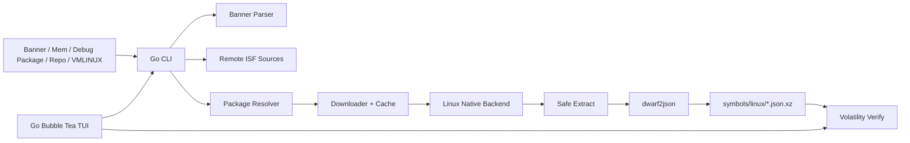

# MEOW 工程化设计文档

本文档是当前工程规则入口，必须随实现实时更新。历史背景和更长的演进记录保留在 `docs/architecture.md` 与 `docs/development-log.md`。

## 1. 工程目标

- 将 `meow` 稳定为 Linux 原生 Volatility 3 Linux 符号表生成工具。
- 固化可执行的开发规则、测试矩阵、CI 门禁和风险闭环机制。
- 优先关闭高/中风险：安全解包、缓存删除保护、远程读取限流、RPM metadata 兼容、配置与 doctor 行为一致性。
- 保持 CLI JSON mode 输出为纯 JSON，避免破坏 TUI runner。

## 2. 当前项目模型

## 3. 模块边界

- `cmd/`: CLI flag、配置合并、JSON/普通输出、命令调度。
- `internal/banner/`: banner 到 `KernelInfo` 的解析。
- `internal/symbolsources/`: 远程 ISF index 读取、banner 精确匹配、raw URL 拼接。
- `internal/resolver/`: debug package 候选生成、HTTP 探测、RPM repo metadata 解析。
- `internal/downloader/`: HTTP 下载、`.part` 临时文件、SHA256 metadata。
- `internal/cache/`: cache layout、metadata、删除保护。
- `internal/backend/`: Linux 原生构建后端、嵌入 bash 脚本、安全解包边界。
- `internal/volatility/`: `vol` CLI 调用封装。
- `internal/tui/`: Go Bubble Tea TUI；通过 argv 模式调用 `meow` 和 `vol`，聚焦 Linux 符号生成闭环。

## 4. 开发规则

- 每次涉及行为、风险、测试或 CI 的修改都必须更新 `tasks.md`。
- 架构、接口、风险策略变化必须更新本文档。
- CLI 显式 flag 优先于配置文件；配置文件只提供默认值。
- JSON mode stdout 必须只输出 JSON；logo、进度条、提示文本只能进入 stderr 或被禁用。
- 外部进程优先使用 argv 模式；禁止把用户输入拼成 shell 命令字符串。
- 对不可信输入的处理必须先校验再执行：远程 URL、archive 成员路径、cache 删除目标、repo metadata。

## 5. 风险登记表

| ID | 严重度 | 风险 | 当前状态 | 关闭标准 |
|---|---|---|---|---|
| R1 | High | debug package 解包可能写出工作目录 | Mitigated | 解包前拒绝绝对路径、`..`、控制字符、Windows path，并校验包内 `vmlinux` realpath |
| R2 | High | `cache clear --cache-dir` 可能误删重要目录 | Mitigated | 默认/自定义 cache 均有删除保护，自定义目录需 sentinel 或 `--force`，且拒绝当前工作目录及其祖先目录 |
| R3 | Medium | 远程 ISF/RPM metadata 无大小上限 | Mitigated | symbol index、repomd、primary metadata 读取有大小上限和清晰错误 |
| R4 | Medium | RPM `primary_db` 被误当 XML metadata | Mitigated | 只解析 `primary`，`primary_db` 返回明确 unsupported |
| R5 | Medium | `config` 展示的默认值未被命令使用 | Mitigated | build/parse/cache/verify 读取配置默认值，CLI flag 覆盖 |
| R6 | Medium | `doctor` 不检查 `vol`，verify 能力提示误导 | Mitigated | doctor 增加 `vol` 检查并区分 build 与 verify 能力 |
| R7 | Medium | TUI 主线分裂导致 CI/文档/入口不一致 | Mitigated | `meow tui` 仅使用 Go Bubble Tea；OpenTUI 子项目删除；CI 由 Go 测试覆盖 TUI |

## 6. 测试矩阵

| Area | Scenario | Gate |
|---|---|---|
| Go unit | `go test ./... -count=1` | 必须通过 |
| Go coverage | `go test ./... -coverprofile=coverage.out` + baseline check | 不得低于基线 |
| Go race | `go test -race ./cmd ./internal/...` | 必须通过 |
| Lint | `golangci-lint run ./...` | 必须通过 |
| Build | `go build -o meow .` | 必须通过 |
| CLI smoke | parse/build dry-run Ubuntu/RPM no remote | 必须通过 |
| Safe extract | malicious path / symlink / traversal fixtures + shell validation | 必须拒绝 |
| Cache clear | unsafe path matrix including cwd ancestors | 必须拒绝危险目录 |
| Remote limits | oversized index/metadata | 必须失败且错误清晰 |
| Config | config defaults + CLI override | 行为符合优先级 |
| Doctor | `doctor --json` | build/verify 能力分类准确 |
| Go TUI unit | `go test ./internal/tui ./cmd` | 必须通过 |
| Docs gate | design/tasks/mermaid/risk checks | 必须通过 |

## 7. CI 门禁策略

- Backend: lint, unit test, coverage baseline, race test, build, smoke。
- TUI: Go Bubble Tea 主线纳入 backend `go test ./...`，不再维护 Bun/OpenTUI frontend job。
- Docs: `design.md`、`tasks.md`、Mermaid 图和风险登记必须存在。
- 覆盖率采用基线+递增，先防止下降，再逐步提高。

## 8. PR 评分机制

每个阶段按 100 分评估，低于 85 不合格。

- 文档与可追踪性：15 分。
- 风险降低：25 分。
- 测试质量：25 分。
- CI 自动化：15 分。
- 兼容性与用户体验：10 分。
- 代码可维护性：10 分。

硬性封顶：CI 不绿最高 50 分；高风险未关闭最高 70 分；未更新 `design.md/tasks.md` 最高 80 分；JSON mode 被污染最高 75 分。

## 9. TUI Command Product Rules

- `meow tui` is the only supported TUI entrypoint.
- The active build source is explicit state. `/mode` and `/source` select `mem`, `banner-file`, `debug-package`, `debug-package-url`, `repo-url`, `vmlinux`, or `manual`.
- Source-setting commands also switch the active source. Example: `/mem dump.raw` selects `mem`; `/debug-package kernel.rpm` selects `debug-package`.
- Manual override fields are source-agnostic: `/distro`, `/kernel`, `/pkgver`, and `/arch` may refine any build source and are passed through to `meow --json build`.
- The TUI must provide state recovery commands: `/unset <field>`, `/reset inputs`, and `/reset all`.
- Destructive cache operations remain protected by `/cache clear --confirm`; `--force` still requires `--confirm`.
- CLI startup presets must match the slash command model: `--source`, `--plugin`, and repeated `--plugin-arg` are supported without shell string expansion.

## 10. TUI Layout Product Rules

- Short and narrow terminals are log-first. `height <= 18` or `width < 40` uses a borderless compact view with status, logs, and command input only.
- Near-short terminals (`19 <= height < 22`) hide side panels and keep the workflow/log panel visible.
- The gradient `MEOW` brand mark remains visible when width allows it; very narrow terminals may truncate it instead of wrapping.
- Rendered log lines must be clipped to the available width before styling so terminal wrapping cannot create vertical overflow.
- Log history must remain navigable with `up/down`, `k/j`, `pgup/pgdown`, `home/end`.
